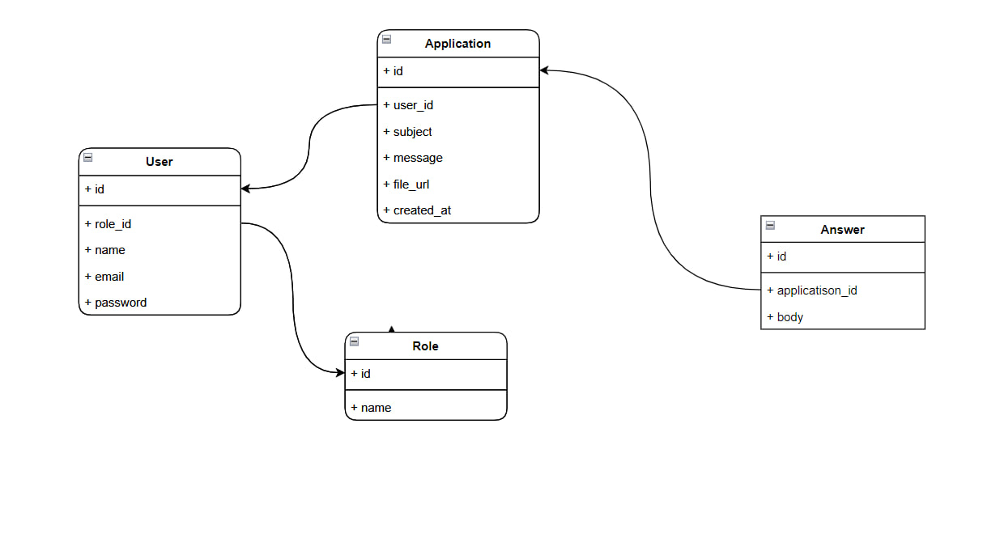

<p align="center"><a href="https://laravel.com" target="_blank"></a></p>

# Laravel task

## Proyekt xaqida

- Bu project o'rganish maqsadida tayyorlandi

Baza strukturasi


### Stepup
- ```cp .env.example .env```
- ```composer install```
- ```npm install```
- ```php artisan key:generate```
- ```php artisan stroge:linke```
- ```php artisan sail:install```
- ```./vendor/bin/sail/ up```
- ```npm run dev```
- ```php artisan queue:work```
- ```./vendor/bin/sail artisan migrate --seed```

## .env
- DB_HOST = mysql
- MAIL_MAILER = log

## Foydalanuvchilar
- User: manage@company
- Password: secret

